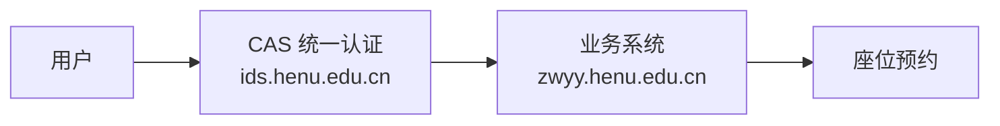
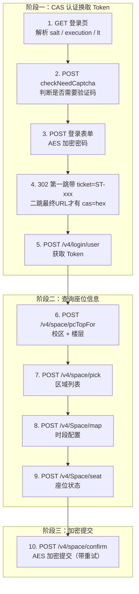

# 河大图书馆座位预约 —— 官方接口逆向与自动预约实现

> **日期**：2026-09-02  
> **来源**：服务器 Azure-NEGIAO 源码分析 + 抓包逆向  
> **关键词**：Python、AES 加密、CAS 认证、定时任务、座位预约

---

## 一、系统概述

河南大学图书馆座位预约系统采用 **CAS 统一认证 + Token 业务鉴权** 架构：



| 项目 | 地址 |
|---|---|
| 官方系统 | `https://zwyy.henu.edu.cn` |
| CAS 认证 | `https://ids.henu.edu.cn` |
| 开放时间 | 每日 `06:30:00` |
| 加密方式 | AES-128-CBC，每日 Key 变化 |

---

## 二、官方接口清单（9 个）

### 认证相关（4 个）

| # | 方法 | 地址 | 说明 |
|---|---|---|---|
| 1 | GET | `ids.henu.edu.cn/authserver/login` | 获取登录页 |
| 2 | POST | `ids.henu.edu.cn/authserver/checkNeedCaptcha.htl` | 检查验证码 |
| 3 | POST | `ids.henu.edu.cn/authserver/login` | 提交登录表单 |
| 4 | POST | `zwyy.henu.edu.cn/v4/login/user` | CAS 换 Token |

### 查询相关（4 个）

| # | 方法 | 地址 | 说明 |
|---|---|---|---|
| 5 | POST | `zwyy.henu.edu.cn/v4/space/pcTopFor` | 校区+楼层 |
| 6 | POST | `zwyy.henu.edu.cn/v4/space/pick` | 区域列表 |
| 7 | POST | `zwyy.henu.edu.cn/v4/Space/map` | 时段配置 |
| 8 | POST | `zwyy.henu.edu.cn/v4/Space/seat` | 座位状态 |

### 预约提交（1 个）

| # | 方法 | 地址 | 说明 |
|---|---|---|---|
| 9 | POST | `zwyy.henu.edu.cn/v4/space/confirm` | AES 加密提交 |


---

## 三、认证流程详解

### 3.1 登录页参数

GET 登录页后从 HTML 解析：

```html
<input name="execution" value="e1s1" />
<input name="lt" value="LT-xxx" />
<input id="pwdEncryptSalt" value="随机盐值" />
```

### 3.2 密码加密

```python
from Crypto.Cipher import AES
from Crypto.Util.Padding import pad
import base64
import random

def encrypt_password(password, salt):
    CHARS = "ABCDEFGHJKMNPQRSTWXYZabcdefhijkmnprstwxyz2345678"
    key = salt.encode()
    iv = ''.join(random.choice(CHARS) for _ in range(16)).encode()
    prefix = ''.join(random.choice(CHARS) for _ in range(64))
    cipher = AES.new(key, AES.MODE_CBC, iv)
    return base64.b64encode(cipher.encrypt(pad((prefix + password).encode(), 16))).decode()
```

### 3.3 换 Token

```http
POST /v4/login/user
Content-Type: application/json

{"cas": "最终落地URL中的 hex 令牌（32位）"}
```

响应：

```json
{"data": {"member": {"token": "eyJ..."}}}
```

---

## 四、AES 加密（预约提交）

| 参数 | 值 |
|---|---|
| Key | `YYYYMMDD` + 反转(`YYYYMMDD`)，16 字节 |
| IV | `ZZWBKJ_ZHIHUAWEI`（固定） |

```python
import json
import base64
from Crypto.Cipher import AES
from Crypto.Util.Padding import pad

def encrypt_reservation(data, date_str):
    compact = date_str.replace("-", "")
    key = (compact + compact[::-1]).encode()  # b"2026090330906202"
    iv = b"ZZWBKJ_ZHIHUAWEI"
    plaintext = json.dumps(data, separators=(',', ':')).encode()
    cipher = AES.new(key, AES.MODE_CBC, iv)
    return base64.b64encode(cipher.encrypt(pad(plaintext, 16))).decode()
```


---

## 五、查询接口详情

### 5.1 校区列表

```http
POST /v4/space/pcTopFor
Authorization: bearer <token>

{"day": "2026-09-03"}
```

```json
{"data": {"list": [{"id": 1, "name": "金明校区",
  "children": [{"id": 5, "name": "一楼"}, {"id": 6, "name": "二楼"}]}]}}
```

### 5.2 区域列表

```http
POST /v4/space/pick
Authorization: bearer <token>

{"premisesIds": [1], "storeyIds": [6], "date": "2026-09-03", "categoryIds": [], "boutiqueIds": []}
```

```json
{"data": {"area": [{"id": 123, "name": "二楼大厅走廊", "free_num": 8}]}}
```

### 5.3 时段配置

```http
POST /v4/Space/map
Authorization: bearer <token>

{"id": 123}
```

```json
{"data": {"date": {"reserveType": "1",
  "list": [{"day": "2026-09-03",
    "times": [{"id": "seg001", "start": "06:30", "end": "22:00"}]}]}}}
```

**reserveType**：`1`=时段, `2`=结束时间, `3`=起止时间

### 5.4 座位状态

```http
POST /v4/Space/seat
Authorization: bearer <token>

{"id": 123, "day": "2026-09-03", "start_time": "06:30", "end_time": "22:00", "label_id": "", "begdate": "", "enddate": ""}
```

```json
{"data": {"list": [
  {"id": 4567, "no": 42, "status_name": "空闲"},
  {"id": 4568, "no": 43, "status_name": "已占用"}
]}}
```

### 5.5 提交预约

```http
POST /v4/space/confirm
Authorization: bearer <token>

{"aesjson": "Base64加密后的字符串"}
```

aesjson 明文：

```json
{"seat_id": "4567", "segment": "seg001", "day": "2026-09-03", "start_time": "", "end_time": ""}
```

**响应判定**：

| 条件 | 含义 |
|---|---|
| code=0 | 成功 |
| msg含"已存在/重复/已预约" | 已预约过 |
| msg含"未开始/未到/频繁" | 继续重试 |
| 其他 | 失败，换下一个座位 |


---

## 六、手把手实战调试教程（新手向）

> 本章是「跟着敲就能跑通」的实操篇：从输入账号密码，到拿到鉴权 Token，最后成功预约一个座位。
> 所有域名、接口、字段均已与服务器源码（`src/backend/seat/henu_login.py` / `henu_client.py` / `henu_main.py`）逐一核对，可直接照抄调试。
> ⚠️ 第 5~8 步的查询接口是**只读**的，随便调、随便试；**第 9 步 `confirm` 是真实预约**，发出后会真的占用你的预约名额，确认清楚再发。

### 6.0 准备工作

| 工具 | 用途 | 获取方式 |
|---|---|---|
| Python 3.8+ | 跑完整示例脚本 | [python.org](https://www.python.org) |
| pycryptodome / requests / beautifulsoup4 | AES 加密、发请求、解析登录页 | `pip install pycryptodome requests beautifulsoup4` |
| Apifox / Postman（可选） | 单独调试查询类接口 | 官网下载 |
| curl（可选） | 命令行快速验证 | Windows 10+ / macOS / Linux 自带 |

先记住两个域名，各管一件事：

| 域名 | 角色 |
|---|---|
| `https://ids.henu.edu.cn` | **CAS 统一认证**（管账号密码，登录全在这） |
| `https://zwyy.henu.edu.cn` | **预约业务系统**（查座位、提交预约，接口全在这） |

### 6.1 第 1 步：请求登录页，拿到三样东西

```http
GET https://ids.henu.edu.cn/authserver/login?service=https://zwyy.henu.edu.cn/v4/login/cas
```

> `service` 参数告诉 CAS「登录成功后把我送回预约系统」。**必须带上**（就是 `zwyy.henu.edu.cn/v4/login/cas` 的 URL 编码），否则最后拿不到 cas ticket。

curl 示例（`-c` 把 Cookie 存成文件，之后每一步都用 `-b cookies.txt -c cookies.txt` 复用同一会话）：

```bash
curl -s -c cookies.txt \
  "https://ids.henu.edu.cn/authserver/login?service=https://zwyy.henu.edu.cn/v4/login/cas" \
  -o login.html

# 从 HTML 里提取三个关键字段
grep -o 'id="pwdEncryptSalt" value="[^"]*"' login.html   # ① 密码加密盐
grep -o 'name="execution" value="[^"]*"' login.html      # ② CAS 流程号
grep -o 'name="lt" value="[^"]*"' login.html             # ③ 一次性票据
```

预期输出类似：

```
id="pwdEncryptSalt" value="Xy3kV2pQ9rAbCdEf"
name="execution" value="e1s1"
name="lt" value="LT-1234567-xxxxxxxxxx-cas"
```

把三个值抄下来备用。⚠️ **`lt` 输入框当前登录页已不再渲染**（实测 2026-09-02），取不到就传空字符串即可，不影响登录。若 salt 取不到 → 登录页结构变化或被风控，先用浏览器打开 `https://ids.henu.edu.cn` 看一眼是否正常。

### 6.2 第 2 步：检查是否需要验证码

```http
POST https://ids.henu.edu.cn/authserver/checkNeedCaptcha.htl
Content-Type: application/x-www-form-urlencoded

username=你的学号
```

curl 示例：

```bash
curl -s -b cookies.txt -c cookies.txt \
  -d "username=你的学号" \
  "https://ids.henu.edu.cn/authserver/checkNeedCaptcha.htl"
```

预期返回 `{"isNeed":false}`。若返回 `true`，请先去浏览器网页端手动登录一次再试（服务器源码遇到这种情况会直接中止，避免无人值守盲试触发风控）。

### 6.3 第 3 步：加密密码并提交登录，拿 cas ticket

密码**不是明文传输**：AES-128-CBC（混合加密算法），Key = 第 1 步的 salt，IV = 16 位随机串，明文 = 64 位随机串 + 真实密码（加密原理见 §3.2）。用 Python 算出 `password` 字段：

```python
import base64, random
from Crypto.Cipher import AES
from Crypto.Util.Padding import pad

#专门剔除容易混淆字符：I、l、O、0、V，只取剩下大小写字母 + 数字。
AES_CHARS = "ABCDEFGHJKMNPQRSTWXYZabcdefhijkmnprstwxyz2345678"

def encrypt_password(password, salt):
    key = salt.encode()                                                    # salt 就是 key，utf-8
    iv = "".join(random.choice(AES_CHARS) for _ in range(16)).encode()     # 随机 IV
    plain = ("".join(random.choice(AES_CHARS) for _ in range(64)) + password).encode()
    return base64.b64encode(
        AES.new(key, AES.MODE_CBC, iv).encrypt(pad(plain, 16))).decode()
```

然后以 **form 表单**（不是 JSON！）提交登录，字段一个都不能少：

```bash
curl -s -b cookies.txt -c cookies.txt -i \
  -d "username=你的学号" \
  --data-urlencode "password=用上面函数加密后的结果" \
  -d "captcha=" \
  --data-urlencode "execution=e1s1" \
  -d "_eventId=submit" \
  --data-urlencode "lt=LT-xxxxxxxxxx-cas" \
  -d "dllt=generalLogin" \
  -d "cllt=userNameLogin" \
  "https://ids.henu.edu.cn/authserver/login?service=https%3A%2F%2Fzwyy.henu.edu.cn%2Fv4%2Flogin%2Fcas"
```

登录成功时是**两跳重定向**，`cas` 十六进制令牌只在第二跳之后才出现，这是最容易踩的坑：

```text
第 1 跳（POST 登录响应 302 的 Location，参数名是 ticket，值以 ST- 开头）：
https://zwyy.henu.edu.cn/v4/login/cas?ticket=ST-601455-xxxxxxxxxxxx

第 2 跳（业务系统验证 ST ticket 后，最终落地 URL 里才有 cas=hex）：
https://zwyy.henu.edu.cn/h5/index.html#/cas/?cas=4e9fc602ce9b300d13fbda7e1c6745fe
```

所以正确做法是：`allow_redirects=False` 拿到第一跳的 `ST-xxx`，再主动 `GET /v4/login/cas?ticket=ST-xxx` 并让它跟随全部重定向，最后用正则 `[?&]cas=([0-9a-fA-F]+)` 从**最终落地 URL** 提取 hex 令牌。**若第一跳连 `ticket=ST-` 都没有 → 学号或密码错误**，此时响应是 200 错误页，页面里 `id="msg"` 节点有具体错误文本可以看。

### 6.4 第 4 步：cas 换 Token（鉴权凭证）

到这里才第一次访问预约系统的域名：

```http
POST https://zwyy.henu.edu.cn/v4/login/user
Content-Type: application/json

{"cas": "第 3 步提取的 ticket"}
```

curl 示例：

```bash
curl -s -X POST "https://zwyy.henu.edu.cn/v4/login/user" \
  -H "Content-Type: application/json" \
  -d '{"cas": "a1b2c3d4e5f6..."}'
```

成功响应（Token 在 `data.member.token` 里）：

```json
{"code": 0, "msg": "成功", "data": {"member": {"id": "你的学号", "token": "eyJhbGciOi..."}}}
```

**把 Token 存好，后续所有业务接口都靠它鉴权。** 请求头写法是 `authorization: bearer<token>`——⚠️ **`bearer` 和 Token 之间没有空格**（源码就是 `"bearer" + token` 直接拼接，这是该系统的约定，与标准 `Bearer xxx` 不同，写错直接 401/403）。

### 6.5 第 5 步：查校区与楼层

后面统一把 Token 放进变量，复制即可跑：

```bash
TOKEN="eyJhbGciOi..."    # ← 换成第 4 步拿到的

curl -s -X POST "https://zwyy.henu.edu.cn/v4/space/pcTopFor" \
  -H "Content-Type: application/json" \
  -H "authorization: bearer$TOKEN" \
  -d '{"day": "2026-09-03"}'
```

> `day` 一般填**明天**的日期（预约系统约的是明天的座位）。想约今天有票余量的场景另说。

响应里 `data.list` 是校区数组，每个校区的 `children` 是楼层——记下你想去的校区 `id`（如金明校区）和楼层 `id`（如二楼）。真实响应节选：

```json
{"code": 0, "msg": "查询成功", "data": {"floors": [
  {"id": "2", "name": "金明二楼"}, {"id": "3", "name": "金明三楼"},
  {"id": "4", "name": "金明四楼"}, {"id": "5", "name": "金明五楼"}]}}
```

### 6.6 第 6 步：查区域（阅览室）列表

```bash
curl -s -X POST "https://zwyy.henu.edu.cn/v4/space/pick" \
  -H "Content-Type: application/json" \
  -H "authorization: bearer$TOKEN" \
  -d '{"premisesIds": [1], "storeyIds": [5], "date": "2026-09-03", "categoryIds": [], "boutiqueIds": []}'
```

`data.area[]` 里每个区域带 `id` / `name` / `free_num`（剩余座位数），挑一个 `free_num > 0` 的，记下它的 `area_id`。

### 6.7 第 7 步：查时段配置

```bash
curl -s -X POST "https://zwyy.henu.edu.cn/v4/Space/map" \
  -H "Content-Type: application/json" \
  -H "authorization: bearer$TOKEN" \
  -d '{"id": 123}'
```

在 `data.date.list` 里找到目标 `day` 那一项，取 `times[]` 中 `status=1` 的时段，记下时段的 `id`（这就是预约时的 `segment`）以及 `start` / `end`。

### 6.8 第 8 步：查座位状态

```bash
curl -s -X POST "https://zwyy.henu.edu.cn/v4/Space/seat" \
  -H "Content-Type: application/json" \
  -H "authorization: bearer$TOKEN" \
  -d '{"id": 123, "day": "2026-09-03", "start_time": "06:30", "end_time": "22:00", "label_id": "", "begdate": "", "enddate": ""}'
```

`data.list[]` 中 `status_name == "空闲"` 的就是可选座位，记下 `id`（seat_id）和 `no`（座位号）。真实响应节选（来自服务器实测抓包）：

```json
{"id": "3290", "no": 1, "status": "已预约", "available": false},
{"id": "3295", "no": 6, "status": "空闲", "available": true}
```

### 6.9 第 9 步：AES 加密并提交预约（真实生效，谨慎操作！）

预约体不是明文提交的：先拼一个紧凑 JSON，用 **AES-128-CBC** 加密成 `aesjson` 再发（原理见第四节）：

| 参数 | 值 |
|---|---|
| Key | `YYYYMMDD` + 其反转，共 16 字节（如 `2026-09-03` → `2026090330906202`） |
| IV | 固定 `ZZWBKJ_ZHIHUAWEI` |
| 明文 | 无空格的紧凑 JSON（`separators=(',',':')`） |

```python
import json, base64
from Crypto.Cipher import AES
from Crypto.Util.Padding import pad

def encrypt_aesjson(seat_id, segment, day, start="", end=""):
    c = day.replace("-", "")                                  # "20260903"
    data = {"seat_id": str(seat_id), "segment": segment, "day": day,
            "start_time": start, "end_time": end}
    plain = json.dumps(data, separators=(",", ":")).encode()
    key = (c + c[::-1]).encode()                              # 2026090330906202
    iv = b"ZZWBKJ_ZHIHUAWEI"
    return base64.b64encode(
        AES.new(key, AES.MODE_CBC, iv).encrypt(pad(plain, 16))).decode()

print(encrypt_aesjson("3295", "seg001", "2026-09-03"))
# → 输出形如 "t3Xk9Qz2wR...==" 的 Base64 串，填进下面 curl 的 aesjson
```

```bash
curl -s -X POST "https://zwyy.henu.edu.cn/v4/space/confirm" \
  -H "Content-Type: application/json" \
  -H "authorization: bearer$TOKEN" \
  -d '{"aesjson": "上面函数输出的Base64串"}'
```

响应判定（与服务器源码一致）：

| 返回 | 含义 | 下一步 |
|---|---|---|
| `code = 0` | ✅ 预约成功 | 结束 |
| msg 含「已存在 / 重复 / 已预约」 | 你已经约过了 | 结束 |
| msg 含「未开始 / 未到 / 频繁」 | 没到开放时间或请求太快 | 等 0.2s 重试 |
| 其他 | 该座位没抢到 | 换下一个座位 |

### 6.10 一键跑通：完整示例脚本

把 9 步合成一个脚本，填入学号密码就能从零跑到预约结果（登录 → 换 Token → 自动找一个空座 → 提交预约）：

```python
# henu_demo.py —— 河大图书馆预约：从登录到预约的完整演示
# 用法: python henu_demo.py 学号 密码 [YYYY-MM-DD]
# 依赖: pip install pycryptodome requests beautifulsoup4
import sys, re, json, base64, random, datetime
import requests
from bs4 import BeautifulSoup
from Crypto.Cipher import AES
from Crypto.Util.Padding import pad

CAS, API = "https://ids.henu.edu.cn", "https://zwyy.henu.edu.cn"
AES_CHARS = "ABCDEFGHJKMNPQRSTWXYZabcdefhijkmnprstwxyz2345678"

def encrypt_password(password, salt):
    """CAS 登录密码加密：key=salt，明文=64随机字符+密码"""
    iv = "".join(random.choice(AES_CHARS) for _ in range(16)).encode()
    plain = ("".join(random.choice(AES_CHARS) for _ in range(64)) + password).encode()
    return base64.b64encode(AES.new(salt.encode(), AES.MODE_CBC, iv).encrypt(pad(plain, 16))).decode()

def encrypt_aesjson(seat_id, segment, day, start="", end=""):
    """预约体加密：key=YYYYMMDD+反转，iv 固定 ZZWBKJ_ZHIHUAWEI"""
    c = day.replace("-", "")
    data = {"seat_id": str(seat_id), "segment": segment, "day": day,
            "start_time": start, "end_time": end}
    plain = json.dumps(data, separators=(",", ":")).encode()
    return base64.b64encode(AES.new((c + c[::-1]).encode(), AES.MODE_CBC,
                          b"ZZWBKJ_ZHIHUAWEI").encrypt(pad(plain, 16))).decode()

def main():
    username, password = sys.argv[1], sys.argv[2]
    day = sys.argv[3] if len(sys.argv) > 3 else str(datetime.date.today() + datetime.timedelta(days=1))
    s = requests.Session()
    s.headers["User-Agent"] = "Mozilla/5.0"

    # 第 1 步：登录页，拿 salt / execution（lt 输入框当前页面已不渲染，必须容错取值）
    login_url = f"{CAS}/authserver/login?service=https%3A%2F%2Fzwyy.henu.edu.cn%2Fv4%2Flogin%2Fcas"
    soup = BeautifulSoup(s.get(login_url).text, "html.parser")
    salt = soup.find("input", {"id": "pwdEncryptSalt"})["value"]
    execution = soup.find("input", {"name": "execution"})["value"]
    lt_inp = soup.find("input", {"name": "lt"})
    lt = lt_inp["value"] if lt_inp else ""
    print("[1] 登录页字段获取成功")

    # 第 2 步：验证码检查
    need = s.post(f"{CAS}/authserver/checkNeedCaptcha.htl", data={"username": username}).text
    print("[2] checkNeedCaptcha:", need)
    if '"isNeed":true' in need:
        sys.exit("该账号需要验证码，请先在浏览器手动登录一次")

    # 第 3 步：提交登录表单。第一跳 302 的 Location 带的是 ticket=ST-xxx（不是 cas=hex！）
    form = {"username": username, "password": encrypt_password(password, salt),
            "captcha": "", "execution": execution, "_eventId": "submit",
            "lt": lt, "dllt": "generalLogin", "cllt": "userNameLogin"}
    r = s.post(login_url, data=form, allow_redirects=False)
    m = re.search(r"[?&]ticket=(ST-[0-9a-zA-Z\-]+)", r.headers.get("Location", ""))
    if not m:
        sys.exit("登录失败：未取得 ticket（检查学号密码是否正确）")
    print("[3] ST ticket 获取成功")

    # 第 3.5 步：拿 ST ticket 去业务系统验证；跟随全部重定向后，最终落地 URL 里才有 cas=hex
    landing = s.get(f"{API}/v4/login/cas?ticket={m.group(1)}")
    m2 = re.search(r"[?&]cas=([0-9a-fA-F]+)", landing.url)
    if not m2:
        sys.exit("登录失败：无法获取 cas 令牌")
    print("[3.5] cas hex 获取成功")

    # 第 4 步：cas 换 token（注意 bearer 后无空格）
    token = s.post(f"{API}/v4/login/user", json={"cas": m2.group(1)}).json()["data"]["member"]["token"]
    h = {"Content-Type": "application/json", "authorization": "bearer" + token}
    print("[4] token 获取成功")

    # 第 5~8 步：查校区 → 楼层 → 区域 → 时段 → 座位，找第一个空座
    top = s.post(f"{API}/v4/space/pcTopFor", json={"day": day}, headers=h).json()
    campus = next(x for x in top["data"]["list"] if "金明" in x["name"])
    print("[5] 校区:", campus["name"])
    for floor in campus["children"]:
        areas = s.post(f"{API}/v4/space/pick", json={
            "premisesIds": [campus["id"]], "categoryIds": [], "storeyIds": [floor["id"]],
            "boutiqueIds": [], "date": day}, headers=h).json()["data"]["area"]
        for a in areas:
            mp = s.post(f"{API}/v4/Space/map", json={"id": a["id"]}, headers=h).json()
            conf = next((d for d in mp["data"]["date"]["list"] if d["day"] == day), None)
            if not conf or not conf.get("times"):
                continue
            t0 = next((t for t in conf["times"] if t.get("status", 1) == 1), conf["times"][0])
            seats = s.post(f"{API}/v4/Space/seat", json={
                "id": a["id"], "day": day, "label_id": "", "start_time": t0["start"],
                "end_time": t0["end"], "begdate": "", "enddate": ""}, headers=h).json()
            free = [x for x in seats["data"]["list"] if x.get("status_name") == "空闲"]
            if free:
                seat = free[0]
                print(f"[6-8] 区域[{a['name']}] 时段[{t0['start']}~{t0['end']}] "
                      f"选中 {seat['no']} 号座 (seat_id={seat['id']})")
                # 第 9 步：真实预约！确认要约了再运行；只想调试查询就删掉下面两行
                aes = encrypt_aesjson(seat["id"], t0["id"], day)
                print("[9] 预约响应:", s.post(f"{API}/v4/space/confirm",
                                              json={"aesjson": aes}, headers=h).json())
                return
    print("没有找到空闲座位")

if __name__ == "__main__":
    main()
```

运行效果示意：

```
$ python henu_demo.py 2xxxxxxxx 你的密码
[1] 登录页字段获取成功
[2] checkNeedCaptcha: {"isNeed":false}
[3] cas ticket 获取成功
[4] token 获取成功
[5] 校区: 金明校区
[6-8] 区域[二楼大厅走廊] 时段[06:30~22:00] 选中 6 号座 (seat_id=3295)
[9] 预约响应: {"code": 0, "msg": "预约成功"}
```

### 6.11 新手踩坑速查

| 坑 | 现象 | 正确做法 |
|---|---|---|
| `bearer` 和 Token 之间加了空格 | 查询接口 401/403 | 写 `authorization: bearer<token>`，**无空格** |
| 登录时没用 Cookie 会话 | salt 正确却登录失败 | 每步都带 `-b cookies.txt -c cookies.txt`，保持同一会话 |
| 提交 JSON 而不是 form 表单 | CAS 返回登录页 | 登录是 `application/x-www-form-urlencoded`，查询/预约才是 JSON |
| 少传 `execution` / `lt` / `_eventId` | 返回登录页无 ticket | 8 个表单字段一个不能少 |
| `day` 填了今天 | 「未开始」或查不到座位 | 默认约**明天**，填明天的 `YYYY-MM-DD` |
| aesjson 明文 JSON 带空格 | 服务端解密后校验失败 | `json.dumps(..., separators=(',',':'))` 紧凑输出 |
| 高频调用 `confirm` | 提示「频繁操作」 | 间隔 ≥ 0.2s；查询接口也别刷太狠，避免风控 |

## 七、自动预约实现

### 7.1 数据库

```sql
CREATE TABLE accounts (
    id INTEGER PRIMARY KEY AUTOINCREMENT, name TEXT, username TEXT UNIQUE,
    password TEXT, area TEXT, seat_no INTEGER,
    fallback_mode TEXT DEFAULT 'nearby', enabled INTEGER DEFAULT 1,
    campus_id TEXT, floor_id TEXT, area_id TEXT, seat_id TEXT
);
CREATE TABLE reservation_history (
    id INTEGER PRIMARY KEY AUTOINCREMENT, username TEXT, seat_no INTEGER,
    area TEXT, day TEXT, status TEXT, message TEXT
);
CREATE TABLE reservation_logs (
    id INTEGER PRIMARY KEY AUTOINCREMENT, username TEXT, action TEXT,
    result TEXT, message TEXT
);
```

### 7.2 登录模块

```python
import requests, re
from bs4 import BeautifulSoup
from Crypto.Cipher import AES
from Crypto.Util.Padding import pad
import base64, random

class HenuLogin:
    def __init__(self):
        self.session = requests.Session()
        self.session.headers["User-Agent"] = "Mozilla/5.0"
        self.token = None

    def login(self, username, password):
        url = ("https://ids.henu.edu.cn/authserver/login"
               "?service=https%3A%2F%2Fzwyy.henu.edu.cn%2Fv4%2Flogin%2Fcas")
        soup = BeautifulSoup(self.session.get(url).text, "html.parser")
        salt = soup.find("input", {"id": "pwdEncryptSalt"})["value"]
        form = {
            "username": username,
            "password": self._encrypt(password, salt),
            "execution": soup.find("input", {"name": "execution"})["value"],
            "lt": soup.find("input", {"name": "lt"})["value"],
            "captcha": "", "_eventId": "submit",
            "dllt": "generalLogin", "cllt": "userNameLogin"
        }
        resp = self.session.post(url, data=form, allow_redirects=False)
        m = re.search(r"cas=([0-9a-fA-F]+)", resp.headers["Location"])
        if not m: raise Exception("登录失败")
        resp = self.session.post("https://zwyy.henu.edu.cn/v4/login/user",
                                json={"cas": m.group(1)})
        self.token = resp.json()["data"]["member"]["token"]
        return self.token

    def _encrypt(self, pwd, salt):
        CHARS = "ABCDEFGHJKMNPQRSTWXYZabcdefhijkmnprstwxyz2345678"
        key, iv = salt.encode(), ''.join(random.choice(CHARS) for _ in range(16)).encode()
        prefix = ''.join(random.choice(CHARS) for _ in range(64))
        cipher = AES.new(key, AES.MODE_CBC, iv)
        return base64.b64encode(cipher.encrypt(pad((prefix+pwd).encode(), 16))).decode()
```


### 7.3 查询与预约

```python
import json, base64
from Crypto.Cipher import AES
from Crypto.Util.Padding import pad

class HenuAPI:
    BASE = "https://zwyy.henu.edu.cn"
    def __init__(self, session, token):
        self.s = session
        self.h = {"Authorization": f"bearer{token}", "Content-Type": "application/json"}

    def get_seats(self, area_id, day):
        r = self.s.post(f"{self.BASE}/v4/Space/seat", json={
            "id": area_id, "day": day, "start_time": "06:30",
            "end_time": "22:00", "label_id": "", "begdate": "", "enddate": ""
        }, headers=self.h)
        return r.json().get("data", {}).get("list", [])

    def confirm(self, seat_id, segment, day, start="", end=""):
        data = {"seat_id": seat_id, "segment": segment, "day": day,
                "start_time": start, "end_time": end}
        compact = day.replace("-", "")
        key = (compact + compact[::-1]).encode()
        iv = b"ZZWBKJ_ZHIHUAWEI"
        pt = json.dumps(data, separators=(',', ':')).encode()
        cipher = AES.new(key, AES.MODE_CBC, iv)
        aesjson = base64.b64encode(cipher.encrypt(pad(pt, 16))).decode()
        return self.s.post(f"{self.BASE}/v4/space/confirm",
                          json={"aesjson": aesjson}, headers=self.h, timeout=5).json()
```

### 7.4 带重试的预约

```python
import time
from datetime import datetime, timedelta

def reserve_with_retry(api, candidates, day, timeout=6, interval=0.2):
    for cand in candidates:
        print(f"尝试: {cand.get('label', '?')}")
        deadline = datetime.now() + timedelta(seconds=timeout)
        while datetime.now() < deadline:
            try:
                resp = api.confirm(cand["seat_id"], cand.get("segment", ""), day)
                code, msg = resp.get("code"), resp.get("message") or ""
                if code == 0:
                    return {"status": "success", "seat_no": cand.get("no")}
                if "已存在" in msg or "重复" in msg:
                    return {"status": "already"}
                if "未开始" in msg or "频繁" in msg:
                    time.sleep(interval); continue
                break
            except Exception as e:
                print(f"异常: {e}"); time.sleep(interval)
    return {"status": "fail"}
```


---

## 八、定时抢座

### 8.1 时序

```
06:29:40    06:29:50         06:30:00    06:30:01~06:30:06
   │           │                │              │
   ▼           ▼                ▼              ▼
开始登录    登录完成         开放预约       高频抢座
(提前20s)   (Token就绪)      (到点)        (0.2s间隔)
```

### 8.2 Cron

```bash
40 29 6 * * * /srv/negiao/src/backend/seat/henu_runner.sh
```

### 8.3 兜底策略

| 模式 | 排序 |
|---|---|
| `nearby` | 按与首选座位距离 |
| `any` | 按座位号从小到大 |

---

## 九、关键常量

| 常量 | 值 | 说明 |
|---|---|---|
| `DEFAULT_OPEN_AT` | `06:30:00` | 开放时刻 |
| `LEAD_SECONDS` | `20` | 提前登录 |
| `RETRY_INTERVAL` | `0.2s` | 重试间隔 |
| `RETRY_TIMEOUT` | `6s` | 单座超时 |
| `GRACE_SECONDS` | `180s` | 宽限期 |

---

## 十、完整调用链路



---

## 十一、常见问题

| 问题 | 原因 | 解决方案 |
|---|---|---|
| 获取不到 pwdEncryptSalt | 登录页结构变化 | 检查 HTML |
| 登录后无 cas 重定向 | 密码错误 | 检查账号 |
| 提示需要验证码 | 账号被风控 | 浏览器手动登录 |
| Token 很快过期 | 官方有效期短 | 每次重新登录 |
| 返回"频繁操作" | 请求太快 | 增大间隔 |

---

> **声明**：本文档仅供学习研究，使用请遵守学校规定。
