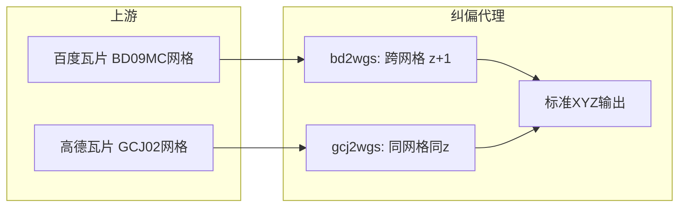

# 瓦片纠偏的接缝问题：从轴对齐近似到精确四角重采样

> 一次真实的线上 bug 复盘：百度 `bd2wgs` 纠偏瓦片在邻接处出现肉眼可见的台阶式拼接缝，而 `gcj2wgs` 却"看起来没事"。
> 顺藤摸瓜发现 gcj 只是缝得轻（`int()` 截断的 1px 量化），最后四条链路统一到同一个 `_quad_warp`。
> 本文记录根因的数学、"精度—清晰度"不可兼得的 trade-off、以及实测性能数据。

---

## 1. 现象：两种缝

- `bd2wgs`（百度 `qt=vtile` 源）：相邻输出瓦片邻接处，细道路/文字笔画断裂约 1px，放大后非常明显。
- `gcj2wgs`（高德源）：轻得多，但仔细看也有——"天安门东"标签被切、细路小台阶。



---

## 2. 两条链路的几何本质差异

这是理解一切的前提：

|  | gcj 双向 | bd 双向 |
|---|---|---|
| 源网格 vs 输出网格 | **同一套** Web 墨卡托标准网格 | **两套独立网格**（BD09MC：居中原点、Y 轴向上、`res(z)=2^(18-z)` 米/像素） |
| 分辨率关系 | 1:1 | `z_bd ≈ z_out + 1` 才能对齐（北京地区） |
| 单瓦片源窗口 | 约 256 源像素 → 256 输出 | 约 306 源像素 → 256 输出（0.84× 缩小） |
| 重采样是否强制 | 否（可 1:1 拷贝） | **是**（不重采样就错位几公里） |

标准 XYZ 的全球像素公式（后文反复用，记为 slippy 约定，x 向东、y 向南）：

$$
px=\frac{lon+180}{360}\cdot 2^z\cdot 256,\quad
py=\left(1-\frac{\ln(\tan\varphi+\sec\varphi)}{\pi}\right)\cdot 2^{z-1}\cdot 256
$$

其中 $\varphi=lat\cdot\pi/180$。z16 北京 1 像素约 1.8 米——后文所有"px"误差都可据此换算成米。

---

## 3. bd 接缝根因：被压扁的平行四边形

旧实现三步：输出瓦片 bbox 四角转 BD09 → 取极值压成轴对齐 box → `resize` 缩到 256。

致命假设是"四角包络 ≈ 矩形"。实测（北京 z16）四个角点的精确源坐标是一个**倾斜平行四边形**：

- 经度方向偏移随纬度变化、纬度方向偏移随经度变化（GCJ 正弦项 + BD09MC 分段多项式的交叉耦合）；
- 角点偏差达 **0.88 源像素 ≈ 0.74 输出像素**（wgs2bd 方向 0.71）。

更糟的是**相邻瓦片在共享边上取极值方向相反**：左瓦片的东边取 `max`，右瓦片的西边取 `min`。
同一条地理边，两边各按自己的极值定边，误差反相关叠加——2px 宽的笔画错开 1px，就是 50% 断裂。

第三个帮凶：`resize(box)` 在 box 边缘截断滤波核支撑，边缘像素只能看到单边上下文。

### 3.1 修复：精确四角 QUAD

直接用四角精确坐标做 QUAD 透视变换。关键性质：**共享边端点由同一地理角点经同一函数算出，bit 级一致**——几何上严格无缝。
剪切分量被精确表达，仅剩瓦片内部二阶非线性（实测 ≤0.2px，不可见）；合成图在 quad 四周天然留有源瓦片余量，边缘滤波核能取到双边上下文。

```python
# gcj_rectify/rectify.py（全项目共用，bd 双向亦导入本函数）
quad = (
    _to_composite(*px_lt),  # NW
    _to_composite(*px_lb),  # SW
    _to_composite(*px_rb),  # SE
    _to_composite(*px_rt),  # NE
)
out = _quad_warp(composite, quad, _BD_RESAMPLE)  # bd 用 BICUBIC
```

验证：合成水平网格线对照，旧 box 法 4 条线错 1 条（1px 台阶），新 quad 法 bd 双向 **0 错位**；
真实 z16 天安门 2×2 拼接道路贯通（剩余文字截断是上游逐瓦片渲染标签的固有裁剪，源列拼接已证实，非纠偏引入）。

---

## 4. 精度—清晰度的 trade-off：为什么 bd 更准、gcj 更锐

这是同网格/跨网格的物理分野，不是参数问题：

- **gcj 锐**：1:1 像素拷贝，输出像素 = 上游像素逐字照抄，零模糊。
- **bd 肉**：306→256 降采样，每个输出像素都是插值混合，有效截止约 0.84 Nyquist 再叠插值滚降。
  源头定死 z+1（z+2 会引入错误缩放级别的制图综合，且拉取量 ×4），滤波器再锐也变不出被降采样吃掉的频率。
  bd 选用 BICUBIC（跨网格降采样保细节）；想再锐只能加锐化后处理（unsharp mask），但那是伪造细节，不建议。

---

## 5. gcj 的高精度 + 高保真方案

gcj 旧伤两处：`int()` 截断的**达 1px 量化台阶**（相邻瓦片不相关），外加约 **−0.5px 系统性偏移**（截断恒向零偏）。

解法是同一个 `_quad_warp`，但用 **BILINEAR**——这是"保真"的关键选择：

1. 同网格 1:1 下，位移整数部分是精确窗口定位（纯拷贝），**只有小数部分参与插值**；
2. BILINEAR 核半径仅 1（BICUBIC 是 2），权重 `(1-fx)(1-fy)` 高度偏向最近像素——小数≈0 时退化为拷贝；
3. z≤9 直通路径零改动（本来就无误差）。

```python
# gcj_rectify/rectify.py
_GCJ_RESAMPLE = Image.BILINEAR  # 一行可切 NEAREST：bit 级保留源像素，残差回到 ≤0.5px
```

### 5.1 一个被否掉的方案

按小数位移逐瓦片自适应选核（接近整数用 NEAREST，其余 BILINEAR）：误差可压到 ≤0.25px 且更多瓦片保持原像素。
否决原因：**相邻瓦片会一锐一肉，锐度台阶本身看起来就像接缝**——用一种缝换另一种缝。无缝的前提是全图统一滤波。

### 5.2 实测数据

| 指标 | 旧（拷贝+截断） | 新（QUAD+BILINEAR） |
|---|---|---|
| 合成水平线接缝偏移 | 0~1px | **0**（NEAREST 同样 0） |
| 真实瓦片梯度能量（锐度代理） | 1.0 | **0.87~0.91** |
| Nyquist 棋盘最坏情况对比度 | — | 53%（病理输入；实际地图内容约九成） |
| 系统性 −0.5px 偏移 | 有 | 无 |

注意：新旧输出整体有约 0.5~1px 的系统性位置差——这是旧截断偏移被修掉的表现，是好事；和旧缓存叠图对比时别误判为回归。

---

## 6. 性能：计算量根本不是瓶颈

实测（256px 瓦片，单操作均值）：

| 环节 | gcj（拷贝） | gcj（QUAD/BILINEAR） | bd（QUAD/BICUBIC） |
|---|---|---|---|
| 重采样 | 0.03ms | 2.6ms | 4.6ms |
| PNG 编码 | ~11ms | ~11ms | ~11ms |
| 暖源端到端 | ~7.5ms | ~8ms 量级 | ~14.5ms |

- NEAREST 仅 0.27ms（备用开关）。
- 源拉取双方都是 2×2~3×3 片（bd 取 z+1，片数相当）；**冷请求下双方都被上游网络（几百 ms）主导**，重采样差的那几毫秒占比 <2%。
- 内存缓存命中双方都是 ~0ms。
- 磁盘缓存策略：只给**输出**分类升版（`bd2wgs→bd2wgs2`、`gcj2wgs→gcj2wgs2` 等），源瓦片缓存复用——只重渲染输出一次，不会引发源站拉取风暴。

结论：纠偏链路的性能账本里，网络 ≫ PNG 编码 > 重采样。用 2~5ms 买亚像素无缝，是全链路最划算的一笔。

---

## 7. 验证方法论：别被梯度指标骗了

一个教训：最初用"接缝处梯度 vs 内部梯度"衡量，修完后新图接缝梯度反而更高——因为新旧输出整体差了约 1px 系统位移，接缝线切到了不同的内容（路上 vs 平地上）。
梯度是内容的函数，不是纯接缝误差函数。可靠的验证分三层：

1. **合成对照**（几何真值）：已知直线图案分别过新旧管线，量接缝两侧线心偏移——这是唯一干净的几何证据；
2. **真实 2×2 目视**（6 倍放大看缝带）：道路是否贯通；
3. **共享边端点数值一致性**：同一地理角点双边计算，`==` 必须为 True（bit 级）。

---

## 8. 开关速查

| 需求 | 改哪里 | 代价 |
|---|---|---|
| gcj 要极致锐度 | `_GCJ_RESAMPLE = Image.NEAREST` | 残差回到 ≤0.5px |
| bd 要极致细节 | 已是 BICUBIC，上限即物理上限 | — |
| 旧错误缓存 | 输出分类已升版，自动失效；`gcj_rectify_cache` 下旧 `bd2wgs/gcj2wgs/...` 目录可手动删 | 一次重渲染 |

---

*对应工程版本：WebGIS-Dev V3.5.38（bd QUAD）→ V3.5.39（gcj 统一 QUAD）。*
*2026-09-03，NEGIAO。*
